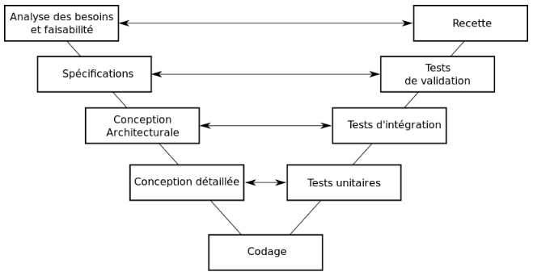
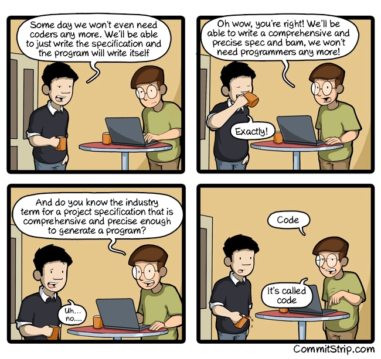

Développer est une tâche complexe, maintenir et faire évoluer un projet existant l’est aussi.

Une mauvaise qualité de code a de nombreux impacts négatifs&nbsp;: un nombre d’anomalies et de régressions affolantes, des coûts et délais exponentiels à chaque évolution, un manque de performances, voir une solution qui ne répond pas aux besoins. Le tout en sapant progressivement le moral des développeurs qui ont le malheur de travailler dans ces conditions.

## UN PROBLÈME DE CODE

Le mauvais code peut prendre de très nombreuses formes, mais on retrouve souvent certaines caractéristiques&nbsp;:

- Redondance
- Faible consistance et absence de norme
- Forte complexité cyclomatique
- Fortes dépendances
- Design chaotique
- Ne révèle pas les intentions métier

Toutes ces caractéristiques rendent le code extrêmement difficile à lire et à comprendre. Comment déterminer ce que fait le programme en lisant le code&nbsp;? Comment localiser une fonctionnalité&nbsp;?

Un autre problème majeur est le turnover parmi les développeurs qui peut générer d’importantes pertes de connaissances s’il est mal anticipé&nbsp;: vous êtes parfaitement incapables de faire un lien clair entre un besoin, une fonctionnalité et son implémentation.

Dès lors, la moindre modification se fait à taton avec son lot de souffrance&nbsp;: effets de bords, incompréhension du code, régressions, etc…

## DOCUMENTER, SPÉCIFIER, RECOMMENCER

Une solution envisagée est de produire d’importantes quantités de documentation et de spécifications. C’est par exemple le parti pris des projets réalisés en cycle en V. L’idée est d’analyser le besoin et conceptualiser la solution à produire avant les développements.

Le premier problème est que plus une erreur est introduite tôt dans ce processus de documentation, plus les documents qui en découlent sont erronés.

- Le périmètre doit donc être figé, sinon&nbsp;:
  - Les documentations sont très coûteuses à maintenir.
  - Les documentations deviennent rapidement obsolètes.
- Les spécifications doivent êtres&nbsp;:
  - complètes
  - cohérentes
  - correctes
  - sans ambiguïté
  - réalisables

En principe, les développeurs ne réalisent que la conception détaillée, cette solution comporte plusieurs inconvénients majeurs&nbsp;:

- L’architecture est imposée aux développeurs, et peut ne pas être adaptée.
- Les développeurs sont focalisés sur les aspects techniques de l’application.

Le développement logiciel est une activité non-déterministe, par conséquent dans la très grande majorité des cas les développeurs rencontreront ces difficultés&nbsp;: aucune spécification ne peut être parfaite, il faut donc savoir improviser. Étant limités à une vision purement technique du projet, ils ne savent y répondre que par des solutions techniques sans aucun sens. Au fil du projet, ceci pollue de plus en plus le code et génère des deltas qui invalident progressivement les documents de référence. Un code illisible, une spécification qui ne correspond pas&nbsp;: vous avez de nouveau perdu les connaissances sur votre projet.

## LE CODE, LA SEULE VÉRITÉ

S’il existe une vérité, c’est bien celle du code. Peu importe ce qui est écrit dans votre spécification, votre ordinateur appliquera ce que votre code lui dicte&nbsp;: le code fait foi, il est lui même la spécification la plus détaillée et la plus précise de votre programme.

Alors pourquoi ne pas l’utiliser comme tel&nbsp;? Pourquoi ne pas s’efforcer à produire du code facilement compréhensible, facilement modifiable&nbsp;? C’est pourtant ceci qui caractérise un code propre. Si celui-ci est expressif, alors n’importe qui (même une personne qui n’est pas développeur) peut le lire et comprendre les actions réalisées. Il est généralement accompagné d’un ensemble de tests unitaires qui expriment chaque cas géré.

On peut voir le métier de développeur de beaucoup de manières différentes, il est souvent comparé à celui d’artisan (software craftsman), je le vois également comme un rôle de traducteur. Quand j’écris du code, je traduis dans un langage compréhensible pour ma machine un besoin qui m’a été exprimé dans un langage qu’elle ne comprend pas.

Mais expliquer quelque chose que l’on ne comprend pas soi-même est insensé. Il est donc primordial que les développeurs comprennent ce qu’ils développent, d’un point de vue technique, mais aussi d’un point de vue métier.

## AMÉLIORER LA QUALITÉ

Pour écrire du code de qualité, il faut faire attention aux comportements, ne pas se contenter de quelque chose qui marche&nbsp;:

*“How it is done is as important as getting it done.”* – [Sandro Mancuso](https://twitter.com/sandromancuso)

Il est donc nécessaires de maîtriser et appliquer avec rigueur certaines pratiques et principes&nbsp;: [TDD](https://en.wikipedia.org/wiki/Test-driven_development), [SOLID](https://en.wikipedia.org/wiki/SOLID_(object-oriented_design)), [SRP](https://en.wikipedia.org/wiki/Single_responsibility_principle), [KISS](https://en.wikipedia.org/wiki/KISS_principle), etc. Lire des livres tels que [Clean Code](https://www.amazon.fr/Clean-Code-Handbook-Software-Craftsmanship/dp/0132350882) de [Robert C. Martin](https://twitter.com/unclebobmartin) sont une bonne façon de les aborder.

Il faut ensuite travailler sur l’expressivité du code, du design. Est-ce que ma classe représente une notion métier&nbsp;? Est-ce que ma méthode exprime une action métier ou technique&nbsp;? Bien entendu, certaines problématiques restent purement techniques, mais elles doivent être les plus discrètes possibles dans le code en étant masquées derrière des interfaces dédiées.

Pour être expressif, encore faut-il savoir quoi exprimer. La meilleure façon est de s’intéresser au métier du logiciel. Discutez, même de façon informelle, avec l’utilisateur final, avec le product owner, avec l’expert métier&nbsp;: N’importe quelle personne pouvant vous aider à comprendre le problème auquel vous apportez une solution.

Une fois que vous aurez compris le métier de vos interlocuteurs, vous serez capables d’échanger facilement avec eux, de challenger leurs besoins. Vous pourrez retranscrire les connaissances acquises dans votre code, celui-ci deviendra alors plus compréhensible, ses intentions seront beaucoup plus claires. En cas de doute, vous saurez également vers qui vous tourner pour répondre à vos questions.

## QUELQUES MÉTHODES

Il existe divers pratiques pour améliorer la compréhension métier des développeurs, et ainsi la qualité du code produit.

Adopter un fonctionnement agile est le premier pas. Ces méthodologies permettent de rapprocher développeurs et clients dans le but de faciliter dialogues et feedbacks. Mettre en place ce fonctionnement est un pré-requis à un certain nombre de méthodes de conception et de développement.

Le [BDD](https://fr.wikipedia.org/wiki/Behavior_driven_development) (*Behavior Driven Development*) est une pratique intéressante à mettre en place. Il s’agit d’une variante du TDD qui met en avant le langage naturel et les interactions métier au travers de features découpées en scénarios d’utilisation. Idéalement, la rédaction de ces scénarios doit se faire avec un expert métier ou un product owner. Le développeur comprend alors clairement ce qu’il développe, et peut s’appuyer sur les notions, le vocabulaire employé dans ces features pour désigner son code. Cette pratique permet également l’émergence de l’*Ubiquitous Language*.

Enfin, le [Domain-Driven Design](https://en.wikipedia.org/wiki/Domain-driven_design). Il a été formalisé pour la première fois par [Eric Evans](https://twitter.com/ericevans0) dans son [blue book](https://www.amazon.fr/Domain-Driven-Design-Tackling-Complexity-Software/dp/0321125215) qui présente un ensemble de patterns tactiques et techniques. Ces patterns couvrent l’ensemble du cycle de vie d’un projet&nbsp;: des méthodologies pour comprendre et représenter un métier, des choix d’architecture, de design, etc. L’idée est de produire une architecture qui présente de manière pratique plus que purement exhaustive les différents composants et interactions d’un domaine. Les points de complexité d’un logiciel doivent alors êtres des points de complexité métier et non techniques. L’arrivée de nouvelles pratiques comme l’event storming, ou d’architectures logiciel comme CQRS/ES découlent directement du DDD.

## POUR QUELS RÉSULTATS

Dans mon équipe actuelle, nous nous efforçons chaque jour d’appliquer ces principes et ces méthodes avec rigueur. Les bénéfices de ce travail se ressentent petit à petit.

La qualité de notre code augmente, le nombre d’anomalies est quasiment nulle. Étant bien découplé, et ainsi ne souffrant pas d’une forte complexité, notre code est également évolutif et peut subir rapidement des modifications qui peuvent être majeures.

Notre code fait foi&nbsp;: en cas d’un doute sur une question métier, le réflexe de tous (même celui du product owner) est de regarder le code. Nos documentations ne servent qu’à formaliser les futurs développements, et dans de rares cas à s’assurer qu’un morceau de code est bien conforme.

Merci à [Ouarzy](https://twitter.com/Ouarzy) et [Nadège](https://twitter.com/nadegerouelle) pour leurs retours.

---

## COMMENTAIRES

<!--Ajoutez votre commentaire ici-->

Envie de commenter ? S’il vous plaît, ajoutez votre commentaire en m'[envoyant une pull request](https://github.com/RomainTrm/Blog?tab=readme-ov-file#how-to-comment).
