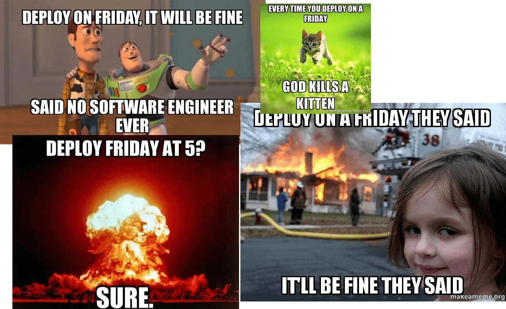

If you're working in IT, you've probably already encountered the "No deploy on friday" mantra/dogma. It's so ubiquitous that they're many meme about it on the internet.

Recently, one of my LinkedIn relation commented a post that way saying something like: "If you had to deploy today (friday) and it went bad, I'm sorry for you". In his comment, he argued that he had shiped more than 10 versions that day and it was no big deal for him, starting a discussion with the author of the post. As I was reading them, I realized they were both right, and above all, by their positioning about "no deploy on friday" I could made a lot of guessing about their respective business and organizational contextes as well as their technical practices.

## Why this "No deploy on friday" rule?

The goal is quite simple: avoid breaking the software before the weekend. Because the dev team will be away for a couple of days or she will have to work fixing a bug instead of enjoying a rest period. Either way, the consequenses are not desirable.

Though, even if it sounds like common sense, there is also a part of [cargo cult](https://en.wikipedia.org/wiki/Cargo_cult_programming) about this rule of thumb which in my opinion is not always pertinent.  

## The Business context

For each business, we have to identify **risks** (the probability that something goes wrong) and **threats** (how bad things are when they occur).

If we're working on a e-commerce website, having a broken feature like payment will have huge consequenses, financial and reputational. But if this same website is only used by people working during office hours, then noone will complain if it's broken during the weekend. The threats are simply not the same.  

Contrary to the regular software or website, some critical systems with a high threat level (like medical or avionic systems that can literaly kill people) require a lot technical and legal validations before being released. In such cases, we've lowered the risks so much that deploying on friday makes no difference.

## The release frequency

The frequency on which we're releasing new versions also impacts risks and threats.

Deploying often means the batches we’re deploying are smaller with less code changes, so we decrease the risk of a defect. In case of the bug, as the number of changes is small, we'll probably isolate the issue and deploy a fix faster, so we also reduce the associated threats.

This has also a cultural/organizational aspect: is deployment an event for our team/company? The release frequency isn't the same if we're working in waterfall, in two weeks sprints or in continuous deployment. The more often we deploy, the more we should automate our release process and rely less on individual validations (like a QA team). This means the cost of deploying a new version (or a fix) isn't the same, our organizational context has a direct impact on our deployment frequency.  

Here again, the "no deploy on friday" is about how long our service will be down. If our deployment frequency limits us to one release per day, or if some mandatory validations are impossible because required people are away during the weekend, then yes, deploying on friday may not be the best idea.

## Technical practices

Obviously, this ability to deploy often doesn't come for free, it requires some skills and extra work to be able to increase deployment frequency. I'm thinking of *zero downtime deployment* capability that allows teams to deploy at anytime without impacting users.  

To achieve such capability, we must meet several requirements. One of them is backward compatibility on our database schema and api contracts: this is used to ensure no downtime during rolling updates, but it can also be used for rollbacking our application to the previous version in case of a major issue. If we have this ability, then deploying on friday should not be frigtening as we can revert the release and take the time to fix it after the weekend.

Another technical trick is *feature toggling* (also known as *feature flags*). This is basically a `if` statement in our code that enable or disable a specific feature. Depending on the use case, the *toggle* value can be global of specific to every users. Here again, if something goes wrong on a feature with a *toggle*, we have the possibility to disable it and take the time needed for the fix. This is also the core concept of the [circuit breaker pattern](https://en.wikipedia.org/wiki/Circuit_breaker_design_pattern), a *toggle* that can flip automatically if too many failures occur on a feature.

> Be carefull though of a potential trap using *feature toggles*. I argued that deploying often helps reducing risks and threats, but this is true as long as the code is executed in production.  
> If we're working on a new feature that remains disabled in prodution, even though we deploy it daily, we're not sure that the code is working properly. If a bug appears the day we choose to flip the *toggle*, we will need to investigate whole feature's code and not assume that the bug is hidden in the latest release changes.

## Conclusion

---

## Comments

<!--Add your comment here-->

Wish to comment? Please, add your comment by [sending me a pull request](https://github.com/RomainTrm/Blog?tab=readme-ov-file#how-to-comment).
