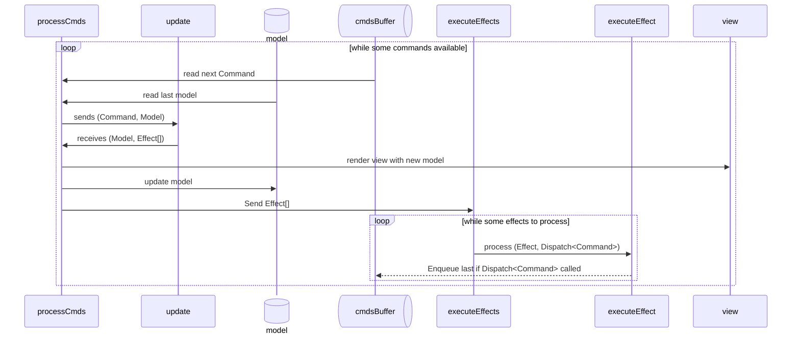

A few months ago in my post [Reaching a limit of Reactive Programming](/posts/reaching-a-limit-of-reactive-programming/), I've mentioned the *MVU* (*Model-View-Update*) pattern could be a solution to the problems I was encountering at that time. I'm now using *MVU* since a few months on other projects and I want to write my own article where I present this pattern in more details.  

This post is the first of a four-post series. We'll be working on webpages, but this pattern can be used in other contexts like desktop applications.

## *Model-View-Update* pattern: core concepts

The simplest way to represent the *MVU* pattern is a loop between the three elements:  

- A *Model* that represent the state of the webpage.
- A *View* function that takes the *Model* as an input to render the page.
- A *Update* function that applies a command to the current *Model* and returns an updated version of it.

```goat
+-------+                 +-------+                               
| Model +---- render ---->+ View  |
+---+---+      view       +---+---+
    ^                         |
  update    +--------+      send
  model ----+ Update +<-- commands
            +--------+
```

The whole pattern lies on a reduction using the *Update* function: `(Command, Model) -> Model`. If you are not familiar with the concept of reduction, just think about a loop that sequentially applies each command to the model then sends the result to the *View* function.  

## Existing technologies

One of the best known implementations of this pattern is [React Redux](https://react-redux.js.org/). Even if I've never used it, I've easily recognized the pattern simply by reading the tutorial on the official website.  

The other main implementation of *MVU* is [Elm](https://elm-lang.org/) and his famous [Elm Architecture](https://guide.elm-lang.org/architecture/) (*TEA*). If you never played with it, I think you should give it a try, the Elm's compiler is really didactic. This architecture has also been recoded with the [Elmish](https://github.com/elmish/elmish) project that transpiles F# code to a React application.  

For the rest of this post, I will reproduce this second implementation.  

## Recoding The Elm Architecture (*TEA*) with Typescript and PReact

For this implementation, I use [PReact](https://preactjs.com/) to render my web application. As you will see, except for the rendering and the main component, there is almost no dependency to the framework, meaning it should be easy to replace with something else.  

> All the following code is available in my [github repository](https://github.com/RomainTrm/Sandbox-Elmish-PReact/blob/main/src/elmish.tsx). It is very similar to the [Elmish implementation](https://github.com/elmish/elmish/blob/v5.x/src/program.fs).

### PReact component

To code a component that runs our *MVU* architecture, let's start with the properties to provide:  

```typescript
// elmish.tsx
export type Dispatch<TCommand> = (cmd: TCommand) => void
type ElmishViewProps<TModel, TCommand, TEffect> = {
    init: { model: TModel, effects: TEffect[] }
    update: (cmd: TCommand, model: TModel) => { model: TModel, effects: TEffect[] }
    view: (model: TModel, dispatch: Dispatch<TCommand>) => VNode
    executeEffect: (effect: TEffect, dispatch: Dispatch<TCommand>) => Promise<void>
}
```

First, we pass as a parameter an initial state `init` for initializing our page.  
Then we recognize our `update` and `view` functions. The `Dispatch<TCommand>` dependency passed as a parameter of the `view` is simply a function that allows the *View* to send commands to the *Update* function.  
I didn't mention *effects* so far. To keep things simple, they're used for side effects like API calls. We'll explore them in more detail later.  

Now we can define our PReact component:  

```typescript
// elmish.tsx
export class ElmishView<TModel, TCommand, TEffect> 
    extends Component<ElmishViewProps<TModel, TCommand, TEffect>, TModel> 
{
    private readonly startProgram: () => void
    private readonly dispatch: Dispatch<TCommand>

    constructor(props: ElmishViewProps<TModel, TCommand, TEffect>) {
        super(props);
        const { start, dispatch } = createProgram(
            props, 
            (model: TModel) => this.setState(model),
            (error: string, ex: unknown) => console.error(error, ex),
        )
        this.dispatch = dispatch
        this.startProgram = start
    }

    override componentDidMount() : void {
        this.startProgram()
    }

    override shouldComponentUpdate(
        _nextProps: Readonly<ElmishViewProps<TModel, TCommand, TEffect>>, 
        nextState: Readonly<TModel>, 
        _nextContext: unknown,
    ) : boolean {
        // Use react-fast-compare
        return !isQuickDeepEqual(this.state, nextState)
    }

    override render() : VNode {
        return this.props.view(this.state, this.dispatch)
    }
}
```

Nothing special here, we build our application, start it when the PReact component is mounted, check if it should re-render because of an updated `Model`.  

### Elmish core logic

Now we can see in detail the core logic of our Elm architecture:  

```typescript
// elmish.tsx
function createProgram<TModel, TCommand, TEffect>(
    props: ElmishViewProps<TModel, TCommand, TEffect>,
    onModelUpdate: (model: TModel) => void,
    onError: (error: string, ex: unknown) => void,
) : { start: () => void, dispatch: Dispatch<TCommand> } {
    const { model: initialModel, effects: initialEffects } = props.init
    let model: TModel = initialModel

    const cmdsBuffer: TCommand[] = []
    let processingCmd = false

    const dispatch = (cmd: TCommand) => {
        // ...
    }

    const processCmds = () : void => {
        // ...
    }

    const executeEffects = (
        effects: TEffect[], 
        onError: (effect: TEffect, ex: unknown) => void,
    ) : void => {
        // ...
    }

    const start = () => {
        ...
    }

    return { start, dispatch }
}
```

Here's the flow to implement: each `Command` is processed with the last known `Model`. Once processed, the `View` and `Model` are updated, then we process the `Effect[]`. Each `Effect` has the possibility to enqueue new `Command` at the end of the `cmdsBuffer` queue.



The `dispatch` function does two things, it adds a new `Command` to the `cmdBuffer` and triggers `processCmds` if it's not already processing.  

```typescript
const dispatch = (cmd: TCommand) => {
    cmdsBuffer.push(cmd)
    if (!processingCmd) {
        processingCmd = true
        processCmds()
        processingCmd = false
    }
}
```

Then `processCmds` is the reduction I've mentioned earlier, it loops on the `cmdBuffer`, applying every `Command` to the last version of the `model` until they're all processed.  

```typescript
const processCmds = () : void => {
    let nextCmd : TCommand | undefined = cmdsBuffer.shift()
    while (nextCmd !== undefined) {
        const cmd : TCommand = nextCmd

        try {
            const { model: newModel, effects: newEffects } = props.update(cmd, model)
            onModelUpdate(newModel) // Model is sent to the component for rendering
            model = newModel
            executeEffects(
                newEffects, 
                (effect: TEffect, ex: unknown) => { 
                    onError(`Error handling effect: ${String(effect)}, raised by command: ${String(cmd)}`, ex) 
                }, 
            )
        } catch (ex) {
            onError(`Unable to process the command: ${String(cmd)}`, ex)
        }

        nextCmd = cmdsBuffer.shift()
    }
}
```

The `executeEffects` function is also a loop that execute every `Effect` returned by a `Command` (or the `init`). Executing an `Effect` returns a `Promise<void>`, but they can raise new `Command` through the `dispatch` function passed as a parameter.

```typescript
const executeEffects = (
    effects: TEffect[], 
    onError: (effect: TEffect, ex: unknown) => void,
) : void => {
    effects.forEach((effect: TEffect) => {
        try {
            props
                .executeEffect(effect, dispatch)
                .catch(err => onError(effect, err))
        } catch (ex) {
            onError(effect, ex)
        }
    })
}
```

Finally, the `start` function "ignites" our *MVU* engine. We send to the component our first `Model`, then we execute our `initialEffects` and run `Command` that may have been raised:  

```typescript
const start = () => {
    processingCmd = true
    onModelUpdate(initialModel)
    executeEffects(
        initialEffects, 
        (ex: unknown) => onError(`Error initializing:`, ex),
    )
    processCmds()
    processingCmd = false
}
```

## Conclusion

That's it! With roughly 110 lines of code, we're now able to write an entire application with the *MVU* pattern.

In the next [blog post](/posts/using-the-elm-architecture-part-2/), we will write our first application using this component.

---

## Comments

<!--Add your comment here-->

Wish to comment? Please, add your comment by [sending me a pull request](https://github.com/RomainTrm/Blog?tab=readme-ov-file#how-to-comment).
