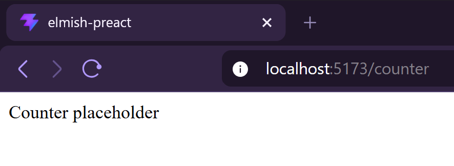
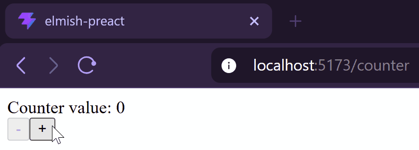
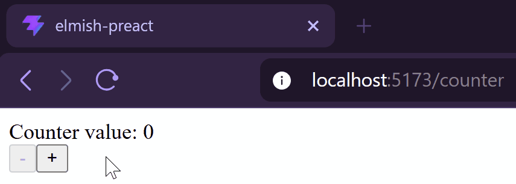

<style>
  img {
    width: 25em
  }
</style>

In the [previous post](/posts/using-the-elm-architecture-part-1/), we've introduced the Elm Architecture (*TEA*) and then wrote a PReact component to implement this pattern. Today it's time to use it! If you haven’t, I recommend that you read the first post before continuing on this one.

If you have been searching for resources about the Elm Architecture on the internet, you must have encountered the "counter" example. This is literally the Elm Architecture's "Hello world".  

Today, I will not derogate from this rule, although I want to make a slightly more complex variant: our first application is a simple counter with a bounded value (min 0 and max 5). Two buttons allow us to increment and decrement it.  

> All the following code is available in my [github repository](https://github.com/RomainTrm/Sandbox-Elmish-PReact/tree/main/src/counter).

## Scaffold our application

First, to call our `ElmishView` component, we must pass the required properties. As a reminder:  

```typescript
// elmish.tsx
type ElmishViewProps<TModel, TCommand, TEffect> = {
    init: { model: TModel, effects: TEffect[] }
    update: (cmd: TCommand, model: TModel) => { model: TModel, effects: TEffect[] }
    view: (model: TModel, dispatch: Dispatch<TCommand>) => VNode
    executeEffect: (effect: TEffect, dispatch: Dispatch<TCommand>) => Promise<void>
}
```

### Scaffold our type system

So, we have to define three types: `Model`, `Command` and `Effect`.  

The `Model` represent the state of our application. At least, it should contain the counter's value:  

```typescript
// counter/counter.app.ts
export type Model = {
    value: number
}
```

Then, the `Command` represents the actions the *view* can trigger, here we can increment or decrement the counter:  

```typescript
// counter/counter.app.ts
export type Command = 
    | { kind: "Increment" }
    | { kind: "Decrement" }
```

Finally, as our application will not produce any side effect like API calls, we should never instantiate the `Effect` type:

```typescript
// counter/counter.app.ts
export type Effect = never
```

### Scaffold our application logic

Then we define our `init`, `update` and `executeEffect` functions.  

First the `init` function. With this example, we don't need to pass any external value to initialize our application, so our function takes `void`, but we are free to pass whatever we need.  
I chose to start our counter at 0:

```typescript
// counter/counter.app.ts
export function init() : { model: Model, effects: Effect[] } {
    return {
        model: {
            value: 0,
        },
        effects: [],
    }
}
```

For now, let’s just provide a default implementation for our `update` and `executeEffect` functions:  

```typescript
// counter/counter.app.ts
export function update(command: Command, model: Model) : { model: Model, effects: Effect[] } {
    return { model, effects: [] } // Does nothing
}

export function executeEffect(_effect: Effect, _dispatch: Dispatch<Command>) : Promise<void> {
    return Promise.resolve() // Does nothing
}
```

### Scaffold our view

I usually declare the `View` in a dedicated file for two reasons:  

- It splits logic in smaller code chunks, making it easier to navigate.
- It isolates the rendering in `.txs` files, while business logic remains in `.ts` files where no rendering can occur.

Let's just put a placeholder for now:

```typescript
// counter/counter.view.tsx
export function View(props: { model: Model, dispatch: Dispatch<Command> }) {
    return <>Counter placeholder</>
}
```

### Build and run our app

Now we have everything we need to implement a new `ElmishView`:  

```typescript
// counter/index.tsx
export function Counter() {
    return (
        <ElmishView
			init={init()}
            update={update}
            executeEffect={executeEffect}
            view={(model: Model, dispatch: Dispatch<Command>) => 
                <View model={model} dispatch={dispatch} />
            }
        />
    )
}
```

And if we execute our application, it renders correctly:



## Implementing the view

We use the `model` to display the counter's value.  

```typescript
// counter/counter.view.tsx
export function View(props: { model: Model, dispatch: Dispatch<Command> }) {
    return <>
        <div>Counter value: {props.model.value}</div>
        <div>
            <button>-</button>
            <button>+</button>
        </div>
    </>
}
```

We could also use the value to decide if we should enable or disable the buttons, but I prefer to avoid this solution as it places some logic inside the view. Instead we add two additional properties `canDecrement` and `canIncrement` to our `Model` and update the `init` function accordingly.  

```typescript {hl_lines=["4-5","12-13"]}
// counter/counter.app.ts
export type Model = {
    value: number
    canDecrement: boolean
    canIncrement: boolean
}

export function init() : { model: Model, effects: Effect[] } {
    return {
        model: {
            value: 0,
            canDecrement: false,
            canIncrement: true,
        },
        effects: [],
    }
}
```

And we use our new properties:

```typescript {hl_lines=[7,9]}
// counter/counter.view.tsx
export function View(props: { model: Model, dispatch: Dispatch<Command> }) {
    return <>
        <div>Counter value: {props.model.value}</div>
        <div>
            <button
                disabled={!props.model.canDecrement}>-</button>
            <button
                disabled={!props.model.canIncrement}>+</button>
        </div>
    </>
}
```

Also, when clicking on a button, we need to dispatch the correct `Command`:

```typescript {hl_lines=[8,11]}
// counter/counter.view.tsx
export function View(props: { model: Model, dispatch: Dispatch<Command> }) {
    return <>
        <div>Counter value: {props.model.value}</div>
        <div>
            <button
                disabled={!props.model.canDecrement} 
                onClick={_ => props.dispatch({ kind: "Decrement" })}>-</button>
            <button
                disabled={!props.model.canIncrement}
                onClick={_ => props.dispatch({ kind: "Increment" })}>+</button>
        </div>
    </>
}
```

Obviously, as we're still running the default implementation of the `update` function, the `Model` is not updated and nothing changes when we click on buttons.



## Implementing the business logic

### Unit-testing our application

One thing I really appreciate about this pattern is its functional aspect: most of the business logic is isolated in a pure, side-effect free and deterministic function, making it easy to test.

```typescript
// counter/counter.test.ts
describe("Increment should", () => {
    test("increment counter and allow decrement", () => {
        const initialModel: Model = {
            value: 0,
            canIncrement: true,
            canDecrement: false,
        }

        const result = update({ kind: "Increment" }, initialModel)

        expect(result.model).toEqual<Model>({
            value: 1,
            canDecrement: true,
            canIncrement: true,
        })
        expect(result.effects).toEqual<Effect[]>([])
    })

    test("increment counter and disallow new increment when counter reaches maximum value", () => {
        const initialModel: Model = {
            value: 4,
            canIncrement: true,
            canDecrement: true,
        }

        const result = update({ kind: "Increment" }, initialModel)

        expect(result.model).toEqual<Model>({
            value: 5,
            canDecrement: true,
            canIncrement: false,
        })
        expect(result.effects).toEqual<Effect[]>([])
    })

    test("do nothing when counter maximum value is already reached", () => {
        const initialModel: Model = {
            value: 5,
            canDecrement: true,
            canIncrement: false,
        }

        const result = update({ kind: "Increment" }, initialModel)

        expect(result.model).toEqual<Model>(initialModel)
        expect(result.effects).toEqual<Effect[]>([])
    })
})

describe("Decrement should", () => {
    // ...
})
```

However, building a consistent model for a test can be annoying. A way to solve this is to fold a sequence of commands in the test:  

```typescript
// counter/counter.test.ts
function applyCommands(commands: Command[], initialModel: Model) 
: { model: Model, effects: Effect[] } {
    return commands.reduce((acc, command) => {
        const { model, effects } : { model: Model, effects: Effect[] } = acc
        const { model: newModel, effects: newEffects } = update(command, model)
        return { model: newModel, effects: [...effects, ...newEffects] }
    }, { model: initialModel, effects: [] })
}

const { model: initialModel } = init()

test("do nothing when counter maximum value is already reached", () => {
    const { model } = applyCommands([
        { kind: "Increment" },
        { kind: "Increment" },
        { kind: "Increment" },
        { kind: "Increment" },
        { kind: "Increment" },
    ], initialModel)

    const result = update({ kind: "Increment" }, model)

    expect(result.model).toEqual<Model>(model)
    expect(result.effects).toEqual<Effect[]>([])
})
```

### Modify the `update` function

Now that our tests are red, we can change the `update` function to implement the expected behaviors.  
Here's another nice aspect of the pattern: each `Command` has its own piece of code. This may seem verbose, but it makes every `Command` easy to implement because it's not coupled to anything else.  

```typescript
// counter/counter.app.ts
export function update(command: Command, model: Model) : { model: Model, effects: Effect[] } {
    return match(command)
        .with({ kind: "Decrement" }, _ => {
            // ...
        })
        .with({ kind: "Increment" }, _ => {
            if (model.value >= 5) return { model, effects: [] }

            const newValue = model.value + 1;
            const newModel: Model = {
                value: newValue,
                canDecrement: true,
                canIncrement: newValue < 5
            }
            return { model: newModel, effects: [] }
        })
        .exhaustive()
}
```

> #### Personal though on Typescript  
>
> In my opinion, we're touching a limit of the typescript's type system with this pattern.  
> Even if union types are supported by the use of flags (like `kind: 'Increment'`), the provided `switch..case` syntax is really inconvenient for manipulating them, particularly because of the shared scope between all cases.  
> That's why I chose to use [ts-pattern](https://github.com/gvergnaud/ts-pattern) here, making the manipulation of the `Command` more practical.

### Running our application

Now that the business logic is implemented, we've got a functional counter:



## Conclusion

In this post, we built our first working app using our own `ElmishView` component.  
We saw how to init our app, how to use the `Model` to render the `View` and finally, how to test and implement the business behaviors.  

In the [next post](/posts/using-the-elm-architecture-part-3), we will explore a new application to introduce the use of `Effect`.

---

## Comments

<!--Add your comment here-->

Wish to comment? Please, add your comment by [sending me a pull request](https://github.com/RomainTrm/Blog?tab=readme-ov-file#how-to-comment).
