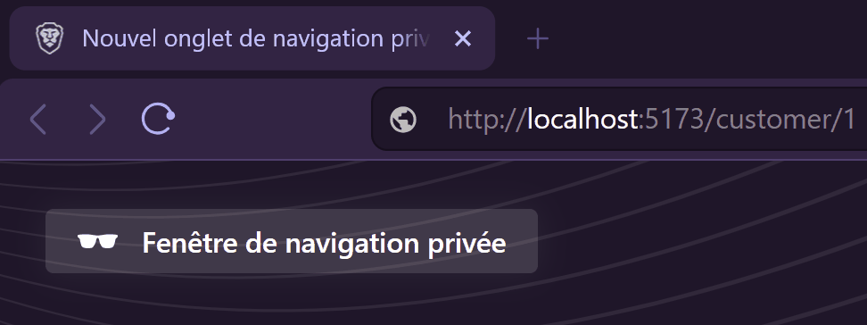
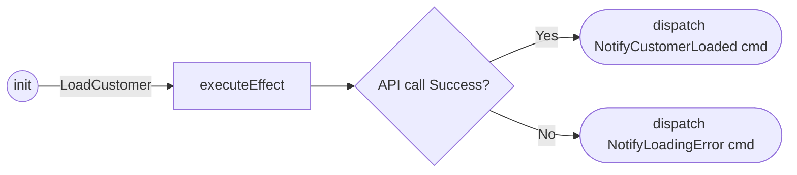

<style>
  img {
    width: 25em
  }
</style>

*This blog post is part of a series where we're using The Elm Architecture (TEA). If you haven't, I strongly recommend reading the previous articles first.*

In the [previous post](/posts/using-the-elm-architecture-part-2/), we've implemented our first application using our `ElmishView` and we saw how to render and update our `Model`. However, our application's logic didn't have to produce any kind of side effect (like API calls), making this example unrepresentative of most of the actual use cases.  

Today, we will navigate into a new app and focus on the use of `Effect` to handle asynchronous and non-deterministic behaviors.

> All the following code is available in my [github repository](https://github.com/RomainTrm/Sandbox-Elmish-PReact/tree/customer-effects/src/customer)

## The use case

Our application is a simple page that displays and allows edition of customers' information. For simplicity, a customer is defined by an id, a name and a premium subscription status. Only the premium subscription status can be updated by the view.  

This is how our final application should behave:  



As we should be able to display different customers, we retrieve the customer's id from the URL, then we should be able to load and save its information with some API calls.  

Our API contract looks something, like this:  

```typescript
// customer/api.ts
export type CustomerId = number
export type CustomerDto = {
    id: CustomerId
    name: string
    premiumSubscription: boolean
}

export interface Api {
    loadCustomer: (id: CustomerId) => Promise<CustomerDto>
    saveCustomer: (customer: CustomerDto) => Promise<void>
}
```

But for now, with everything we've learned so far, our type system doesn't handle any side effect:  

```typescript
// customer/customer.app.ts
export type Model = {
    customerId: CustomerId
    loading: boolean
    customer: CustomerDto | null
    customerEdition: CustomerDto | null
}

export type Command = 
    | { kind: "EditCustomer" }
    | { kind: "UpdatePremiumSubscription", value: boolean }
    | { kind: "SaveCustomer", customer: CustomerDto }
    | { kind: "CancelEdit" }

export type Effect = never

export function init(customerId: CustomerId) : { model: Model, effects: Effect[] } {
    return {
        model: { 
            customerId: customerId,
            customer: null,
            customerEdition: null,
            loading: true,
        },
        effects: [],
    }
}
```

You may have noticed this time our `init` function receives `CustomerId` as a parameter to initialize our application. For now, the `SaveCustomer` command does nothing.

## Loading the customer

The first thing we have to do is making an API call retrieve the customer. However, these are asynchronous and non-deterministic, so we should avoid making such calls in our `update` function that is synchronous and pure.  

To query our customer, we'll use an `Effect` and then dispatch a `Command` with the result returned by the API.  



We begin by updating our types, we add our new `Effect` and two new commands:  

```typescript
// customer/customer.app.ts
export type Command = 
    | { kind: "NotifyCustomerLoaded", customer: CustomerDto }
    | { kind: "NotifyLoadingError", error: string }
    | // ...

export type Effect =
    | { kind: "LoadCustomer", customerId: CustomerId }
```

Then we update our `init` function to return the `LoadCustomer` effect. With this, an API call will be trigger every time we open the page:  

```typescript
// customer/customer.app.ts
export function init(customerId: CustomerId) : { model: Model, effects: Effect[] } {
    return {
        model: { 
            // ...
        },
        effects: [
            { kind: "LoadCustomer", customerId }
        ],
    }
}
```

Now, we must handle our effect inside the `executeEffect` function. But first, we update the function's signature to gain access to the `Api`.  

```typescript
// customer/customer.app.ts
export function executeEffect(effect: Effect, dispatch: Dispatch<Command>, api: Api) : Promise<void> {
```

Obviously, our `ElmishView` component is still expecting a function with two parameters, so we declare and pass an override with the API encapsulated:  

```typescript
// customer/index.tsx
export function Customer({ customerId } : { customerId: string }) {
    function executeEffectWithApi(effect: Effect, dispatch: Dispatch<Command>) {
        return executeEffect(effect, dispatch, fakeApi)
    }

    return <ElmishView
        init={init(parseInt(customerId))}
        update={update}
        executeEffect={executeEffectWithApi}
        view={(model: Model, dispatch: Dispatch<Command>) => 
            <View model={model} dispatch={dispatch} />
        }
    />
}
```

Implementing `executeEffect` is quite simple. We call our `Api` and return a success or an error depending on the `Promise`:  

```typescript
// customer/customer.app.ts
export function executeEffect(effect: Effect, dispatch: Dispatch<Command>, api: Api) : Promise<void> {
    return match(effect)
        .returnType<Promise<void>>()
        .with({ kind: "LoadCustomer" }, ({ customerId }) => {
            return api.loadCustomer(customerId)
                .then(customer => 
                    dispatch({ kind: "NotifyCustomerLoaded", customer })
                )
                .catch((_error: unknown) => 
                    dispatch({ kind: "NotifyLoadingError", error: "Error while loading customer" })
                )
        })
        .exhaustive()
}
```

This can be tested as well but it gets more complicated than testing the `update` function, because we'll have to mock or fake our `Api` dependency.  

What's why I would advise you put the minimum logic there, just return the result into the `Command` and let the `update` function do the job. In this use case, it's just leaving the loading state and setting either the customer data or an error:  

```typescript
// customer/customer.app.ts
export function update(command: Command, model: Model) : { model: Model, effects: Effect[] } {
    return match(command)
        .returnType<{ model: Model, effects: Effect[] }>()
        .with({ kind: "NotifyCustomerLoaded" }, ({ customer }) => {
            const newModel: Model = {
                ...model,
                customer,
                loading: false,
            }
            return { model: newModel, effects: [] }
        })
        .with({ kind: "NotifyLoadingError" }, ({ error }) => {
            const newModel: Model = {
                ...model,
                error,
                loading: false,
            }
            return { model: newModel, effects: [] }
        })
        // ...
        .exhaustive()
}
```

## Saving the customer

Saving the customer follows the same flow, so there's no point for me to detail every step. We declare and handle a new `Effect` and two `Command`. In the existing logic, we just need to update the `SaveCustomer` to return our new `Effect`:  

```typescript
export type Command = 
    | // ...
    | { kind: "SaveCustomer", customer: CustomerDto } // Already declared
    | { kind: "NotifySaveSucceeded" }
    | { kind: "NotifySaveFailed", error: string }

export type Effect =
    | // ...
    | { kind: "SaveCustomer", customer: CustomerDto }

// customer/customer.app.ts
export function update(command: Command, model: Model) : { model: Model, effects: Effect[] } {
    return match(command)
        .returnType<{ model: Model, effects: Effect[] }>()
        // ...
        .with({ kind: "SaveCustomer" }, ({ customer }) => {
            const newModel: Model = {
                ...model,
                loading: true,
            }
            const effects: Effect[] = [{ kind: "SaveCustomer", customer }]
            return { model: newModel, effects }
        })
        .with({ kind: "NotifySaveSucceeded" }, () => {
            const newModel: Model = {
                ...model,
                customer: model.customerEdition,
                customerEdition: null,
                loading: false,
            }
            return { model: newModel, effects: [] }
        })
        .with({ kind: "NotifySaveFailed" }, ({ error }) => {
            const newModel: Model = {
                ...model,
                error,
                loading: false,
            }
            return { model: newModel, effects: [] }
        })
        .exhaustive()
}

export function executeEffect(effect: Effect, dispatch: Dispatch<Command>, api: Api) : Promise<void> {
    return match(effect)
        .returnType<Promise<void>>()
        // ...
        .with({ kind: "SaveCustomer" }, ({ customer }) => {
            return api.saveCustomer(customer)
                .then(() =>
                    dispatch({ kind: "NotifySaveSucceeded" })
                )
                .catch((_error: unknown) => 
                    dispatch({ kind: "NotifySaveFailed", error: "Error while saving customer" })
                )
        })
        .exhaustive()
}
```

## Conclusion

In this post, we learned how to perform non-deterministic and asynchronous operations within our Elm Architecture. This may seem like a cumbersome process to make a single API call, with a lot of indirection, but it isolates side effects, protecting the rest of the code base and keeping it easier to understand and maintain. In my opinion, this is a good tradeoff.  

In the [last post](/posts/using-the-elm-architecture-part-4) of this series, we will see how to handle larger applications by extracting and using subcomponents.

---

## Comments

<!--Add your comment here-->

Wish to comment? Please, add your comment by [sending me a pull request](https://github.com/RomainTrm/Blog?tab=readme-ov-file#how-to-comment).
